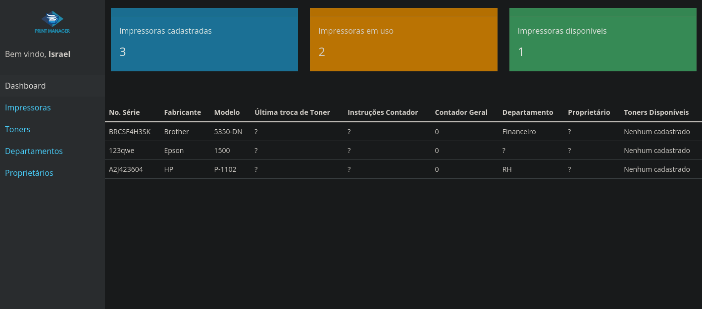

### Como abrir o projeto
1. Baixe os arquivos
2. Inicie um servidor de Banco de Dados PostgreSQL e rode o arquivo `script.sql`
3. Modifique a variável DATABASE_URL no arquivo `/api/.env` com os dados de acesso do seu servidor de Banco de Dados.
4. Instale as dependências da API com o comando `npm install`
5. Inicie a API com o comando `npm run dev`
6. Inicie um servidor HTTP (ex: Live Server) e nele abra o arquivo `/frontend/view/index.html`
7. Em caso de dúvidas, problemas ou sugestões fale com o autor!
